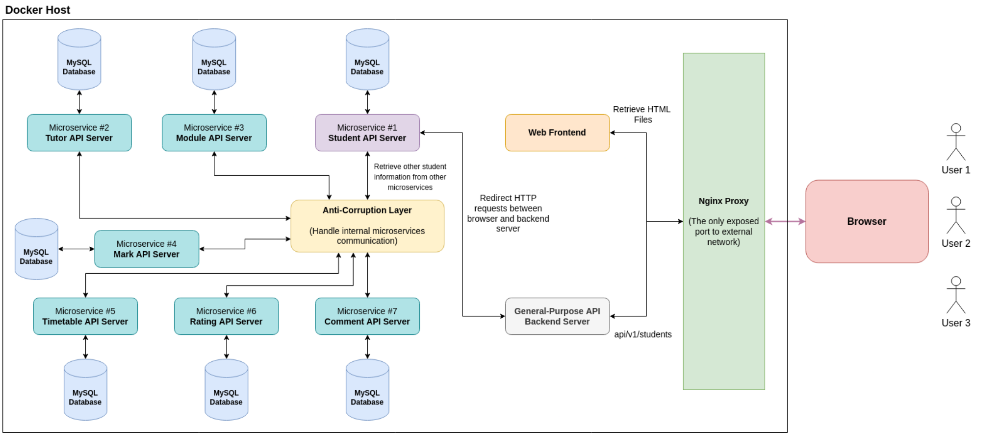
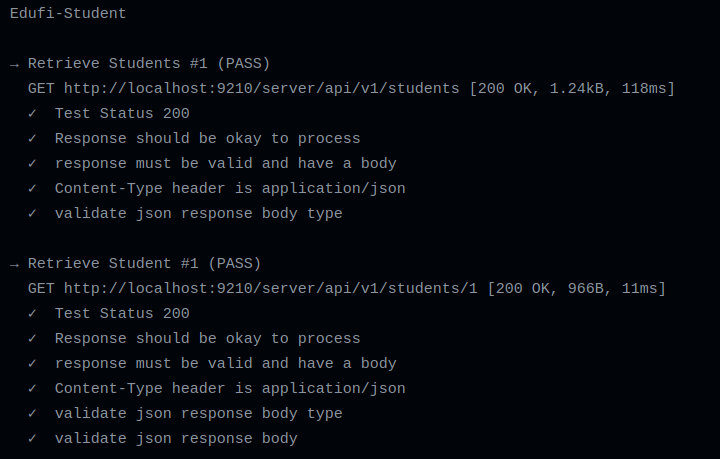
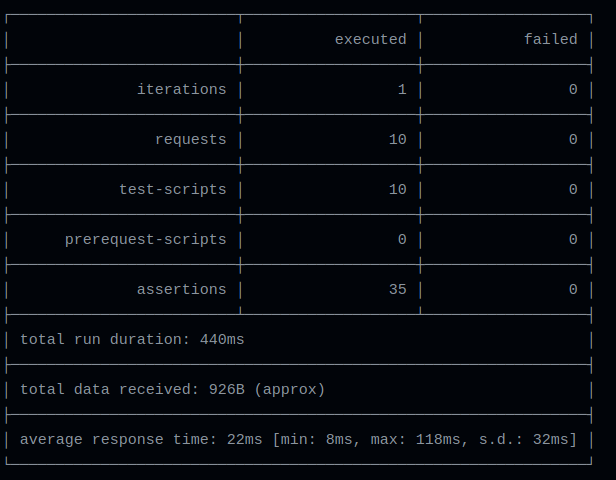
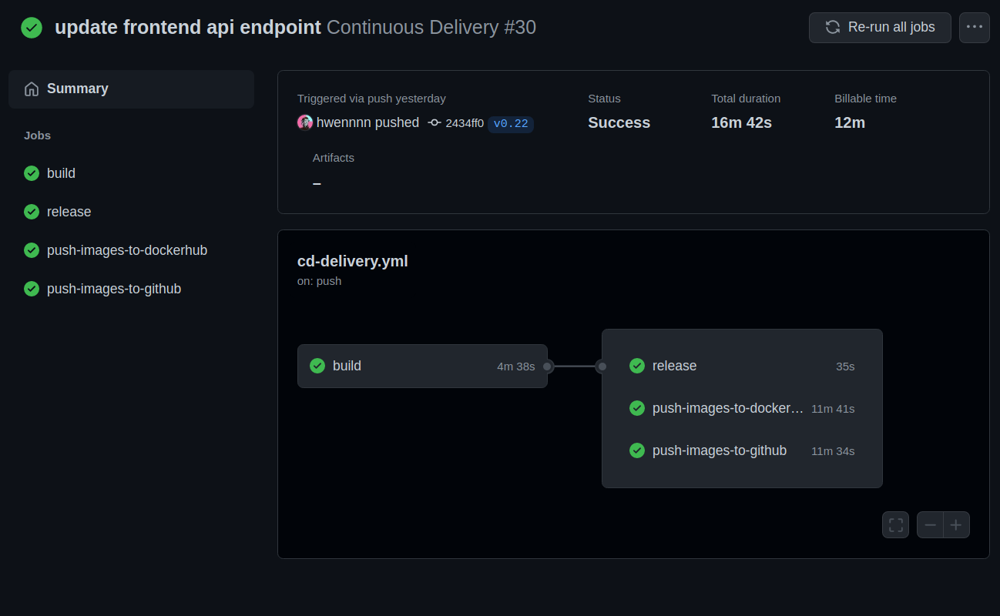
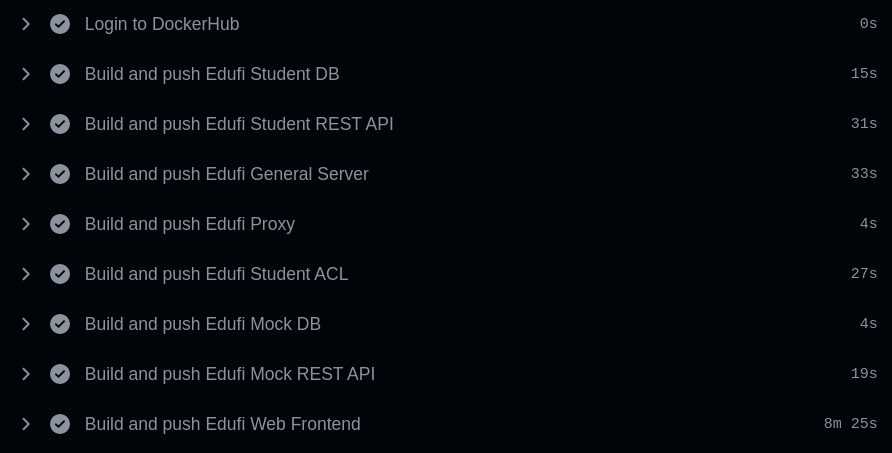

# EduFi-3.5-Student

## Table of Contents

- [Folder Structure](#Folder-Structure)

- [Usage](#Usage)

- [Containers](#Containers)

- [Architecture Diagram](#Architecture-Diagram)

- [Architecture Design Consideration](#Architecture-Design-Consideration)

  - [Nginx Proxy Server](#Nginx-Proxy-Server)
  - [Microservices Design](#Microservices-Design)
  - [Anti-corruption Layer](#Anti-corruption-Layer)
  - [React Next.js Frontend](#React-Nextjs-Frontend)
  - [General-Purpose API Backend Server](#General-Purpose-API-Backend-Server)

- [DevOps Approach](#Devops-Approach)

  - [Continuous Integration](#Continuous-Integration)
  - [Continuous Delivery](#Continuous-Delivery)

- [API Documentation](#API-Documentation)

- [Web Frontend Screenshots](docs/frontend_screenshots.md)

- [Credits](#credits)

## Folder Structure

|       Codebase       |            Description             |
| :------------------: | :--------------------------------: |
| [frontend](frontend) |       React Next.js Frontend       |
|  [backend](backend)  |           EduFi Backend            |
|   [server](server)   | General-Purpose API Backend Server |

## Usage

### Development

```bash
docker-compose up --build
```

### Run in Production Mode

```bash
docker-compose -f docker-compose.yml -f docker-compose.prod.yml up --build
```

**The SQL setup script will be executed automatically at build time.**

Finally, open http://localhost:9210 for the frontend client.

## Containers

Each microservice in the project is containerised and hosted on the docker registries therefore the containerised application will become lightweight, efficient to move between environments and run independently. These characteristics further enhance the benefits of developing microservices.

|                  Container Name                  |                  Description                   | Links                                                                                                                                                                         |
| :----------------------------------------------: | :--------------------------------------------: | ----------------------------------------------------------------------------------------------------------------------------------------------------------------------------- |
|  [edufi_student_db](backend/students/database)   |  MySQL database used for Student Microservice  | [DockerHub](https://hub.docker.com/r/hwendev/edufi_student_db) <br> [Github Packages](https://github.com/hwennnn/EduFi-3.5-Student/pkgs/container/edufi_student_db)           |
| [edufi_student_backend](backend/students/server) |    REST API Server for Student Microservice    | [DockerHub](https://hub.docker.com/r/hwendev/edufi_student_backend) <br> [Github Packages](https://github.com/hwennnn/EduFi-3.5-Student/pkgs/container/edufi_student_backend) |
|    [edufi_student_acl](backend/students/acl)     | Anti Corruption Layer for Student Microservice | [DockerHub](https://hub.docker.com/r/hwendev/edufi_student_acl) <br> [Github Packages](https://github.com/hwennnn/EduFi-3.5-Student/pkgs/container/edufi_student_acl)         |
|      [edufi_mock_db](backend/mock/database)      |              Mock MySQL database               | [DockerHub](https://hub.docker.com/r/hwendev/edufi_mock_db) <br> [Github Packages](https://github.com/hwennnn/EduFi-3.5-Student/pkgs/container/edufi_mock_db)                 |
|    [edufi_mock_backend](backend/mock/server)     |       REST API Server for Mock Database        | [DockerHub](https://hub.docker.com/r/hwendev/edufi_mock_backend) <br> [Github Packages](https://github.com/hwennnn/EduFi-3.5-Student/pkgs/container/edufi_mock_backend)       |
|           [edufi_proxy](backend/proxy)           |              Nginx Reverse Proxy               | [DockerHub](https://hub.docker.com/r/hwendev/edufi_proxy) <br> [Github Packages](https://github.com/hwennnn/EduFi-3.5-Student/pkgs/container/edufi_proxy)                     |
|          [edufi_general_server](server)          |       General-Purpose API Backend Server       | [DockerHub](https://hub.docker.com/r/hwendev/edufi_general_server) <br> [Github Packages](https://github.com/hwennnn/EduFi-3.5-Student/pkgs/container/edufi_general_server)   |
|          [edufi_web_frontend](frontend)          |             React Next.js Frontend             | [DockerHub](https://hub.docker.com/r/hwendev/edufi_web_frontend) <br> [Github Packages](https://github.com/hwennnn/EduFi-3.5-Student/pkgs/container/edufi_web_frontend)       |

## Architecture Diagram



## Architecture Design Consideration

### Nginx Proxy Server

Ideally, in real practice, there should be only one endpoint exposed to the external network. In this project, there are two services implemented for the end-user which are web frontend, and the server API. Hence, the Nginx proxy server is used to better facilitate this idea.

By definition, a Nginx HTTPS reverse proxy is an intermediary proxy service which takes a client request, passes it on to one or more servers, and subsequently delivers the server's response back to the client. In this project, the Nginx reverse proxy is the only exposed endpoint (at port 9210) to the external network. The user browses `http://localhost:9210` for the frontend, and retrieves the data from `http://localhost:9210/server`.

Based on the configuration in the proxy, the client requests from `http://localhost:9210` will be redirected to the web frontend container which resides at port 3000 internally in the docker network. Meanwhile the API requests from `http://localhost:9210/server` will be redirected to the general server container which resides at port 5000 internally in the docker network.

One of the benefits of using the Nginx reverse proxy is that it reduces the surfaced endpoints needed for the backend, in other hands, it also reduce complexity at the user end as the user would only need to know one endpoint of the service. Besides, it also increases security by acting as a line of defense for the backend servers.

### Microservices design

The business logic from the assignment case studies (3.5 Student Package) breaks down into **seven API microservices** (student, tutor, module, mark, timetable, rating and comment). In this project, I was responsible for the student domain and I implemented the [student database](backend/students/database) and its [REST API backend](backend/students/server). I would need to be dependent on another 6 microservices developed by other people. As of 29 January 2022, I was having difficulties to consumer other microservices, hence I decided to create a [mock database](backend/mock/database) and [mock server](backend/mock/server) to satisfy the necessary requirements and for demo purposes.

In general, each microservice is connected to its own MySQL database. The microservice will serve a server endpoint which allows external http requests with methods (GET/PUT/POST) to retrieve, create, or update the row(s) in the backend database related to the microservice module. For example, **student microservice** server allows for retrieving all students with customisable query parameters at `api/v1/students`, and retrieving, creating, updating for a specific student at `api/v1/students/{studentid}`.

In addition, each microservice is completely isolated from another microservices, hence will not cause any negative impacts when the other microservice is down or being redeployed. With the design of the microservice, each microservice is independent and loosely coupled, and can be independent upgraded or restarted, unlike monolith or n-tier architecture which would need to restart the whole system after the new deployment.

In the case when one microservice needs to communicate with another microservices, **anti-corruption layer** is implemented between the layer in the backend to facilitate the communication.

### Anti-corruption layer

In betweeen the microservices, the **anti-corruption layer** is implemented to handle and redirect internal microservices requests. The server is written in **node.js and Express.js**.

By definition, anti-corruption layer (ACL) creates an isolating layer to provide clients with functionality in terms of their own domain model. The layer talks to the other system through its existing interface, requiring little or no modification to the other system. Internally, the layer translates in both directions as necessary between the two models. (Quoted from **Eric Evans, Domain Driven Design, 16th printing, page 365**)

In short, an ACL is not just about separating the messy code, but as a means to communicate between bounded contexts. It translates from one context to the other, so that data in each context reflects the language and the way that that context thinks and talks about the data.

In the project, the express server serves at `port 4000` internally at the docker network. When one microservice wants to communicate with another microservice, the microservice only needs to send http request with related pathname, for example `api/v1/modules`, to the server which acts as ACL. By this way the microservice would not have to explicitly call that particular microservice endpoint, which is against the domain driven design (DDD). Instead, the microservice only knows and calls one surface endpoint which will do the lifting communication work.

The usage of ACL in the project is that when the student microservice needs to communicate with other microservicse in order to retrieve the module, mark, timetable, rating and comment information associated with the student. The student microservice will send http request with related information to the ACL, and the ACL will redirect the requests to respective microservices and return the desired result back to the trip microservice.

### React Next.js Frontend

Kindly refer to [this](docs/frontend_screenshots.md) for the screenshots of the web frontend.

The frontend is written is React.js with Next.js. The frontend simulates the features of EduFi platform such as

- View students particulars
- Update student particulars
- View modules taken by student
- View original results of student
- View adjusted results of student after marks trading
- View timetable of student
- List all students with ratings
- Search for other students
- View other students’ profile, modules, timetable, ratings, and comments

In the case when the frontend wants to communicate with the backend server to fulfill client requests, a **general-purpose API backend server** is implemented in between the layer of frontend and backend to facilitate the communication.

### General-Purpose API Backend Server

It works similarly as ACL, but the communication takes place between the backend and the frontend.

With this generalised backend server, there would be only one server endpoint surfaced to the client. This could improve backend security by preventing abusing of the backend microservice server as those microservices server endpoint are not opened to the public.

For example, when the user wants to update his student particulars, the http request containing student information will be sent to the generalised server `http://localhost:9210/server`. The server will then redirect the request to the student microservice for the update student particulars. The result will then sent back to the originated frontend server.

## DevOps Approach

### Continuous Integration

Automated API integration tests would be conducted when there are commit changes pushed to the branch. This results in better code quality as code is being continuously tested allowing for bugs and errors to quickly surface after each trigger.


When the commits are pushed to the branch, the workflow will first compose the containers in the virtualised environment. Then, another workflow will run to test the API endpoints on that environment through postman testing to ensure the API is working in the standalone virtualised environment.


The final result would look as shown above. If the integration testing fails, it will automatically create an issue in Github to notify the developers the errors of the CI workflows.

### Continuous Delivery

Continuous Delivery is implemented to create a release package to Git Package Release Area. It eliminates the manual creation of packages, but instead it is done automatically to create the release after being triggered by the push tag event. The automatic workflow also ensures that all proper testing has been done before the release. Through automation, it makes releasing the application reliable.



From the above diagram, it can be seen that the creation of the tag triggered the CD pipeline
which will first conduct the testing pipeline to ensure that the API integration testing has passed in the production environment, and then it will release a package using the standard GitHub release mechanism. A release branch will also be created by the workflow for better keeping track of the branch with different versions.



Besides, the CD pipeline will build and push the container images to the DockerHub and Github Packages. This successfully eliminates the manual tagging and pushing the images, instead they are being done automatically especially there are eight container images need to be pushed in this project. As a result, the task of releasing container images to Docker registries becomes more reliable and manages to save a lot of time of the developers.

## API Documentation

Kindly refer to [this](docs/README.md) for more details on the EduFi Student API Server and Mock REST API Server.

## **Credits**

<table>
  <tr>
    <td align="center"><a href="https://github.com/hwennnn"><br /><sub><b>Wai Hou Man <br> (S10197636F) </b></sub></a><br />
    </td>
  </tr>
</table>
