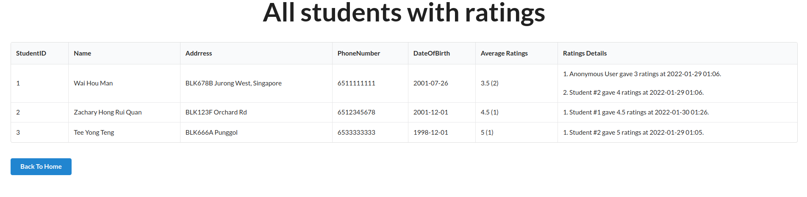

# The screenshots of React Next.js Frontend

## Home

### Login as a Student

### Login as a Student (Failed due to invalid crendentials)

### Login as a Tutor

## Student View

### Student Home

### View students particulars

### Update student particulars

### View modules taken by student

### View original results of student

### View adjusted results of student after marks trading

### View timetable of student

### List all students with ratings

### Search for other students + View other students’ profile, modules, timetable, ratings, and comments

## Tutor View

### Tutor Home

### Search for other students + View their profile, modules, results, timetable, ratings, and comments

